---

title: "Year of the Rabbit"

---

<center>
<strong>1. 🔍 Enumeration Part + Directory Bruteforcing</strong><br> 
<strong>2. ☠️ Exploitation Part</strong><br>
<strong>3. 🔓 Privilege Escalation Part</strong>
</center>

---


<h2><span style="color:red">1. 🔍 Enumeration Part + Directory Bruteforcing</span></h2><br>


We start with an Nmap scan:<br>
<center>
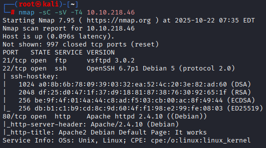 
</center><br>

Next, we perform directory bruteforcing using Gobuster:<br>
```bash
gobuster dir -u http://10.10.136.217/ -w=/usr/share/wordlists/dirbuster/directory-list-lowercase-2.3-medium.txt
```
<br>
<center>
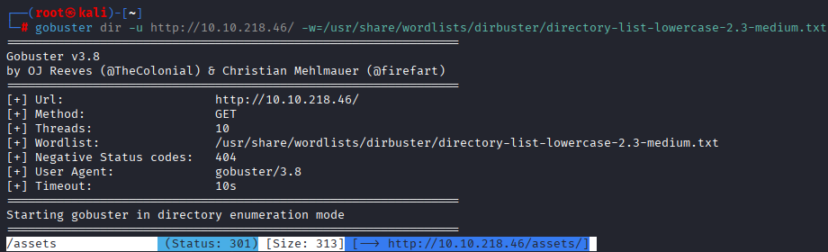
</center><br>


The scan reveals an /assets directory. Let's explore it further:<br>
```bash
gobuster dir -u http://10.10.136.217/asset/ -w=/usr/share/wordlists/dirbuster/directory-list-lowercase-2.3-medium.txt -x php
```
<br>
<center>
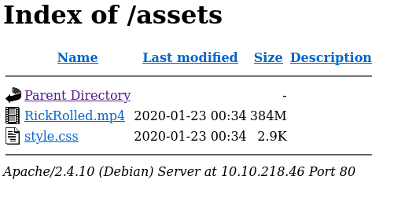
</center><br>


We check the "style.css" file, let's see what's hidden there:<br>
<center>

</center>


Hint tells us to go and check "/sup3r_s3cr3t_fl4g.php":<br>
<center>

</center><br>


Here you can notice some redirection moves and the browser tells us to turn off javascript, lets do this:<br>
<center>
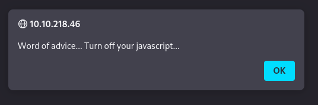
</center><br>


To turn JS off for Firefox just follow my guide:<br>
<center>
<br><br>
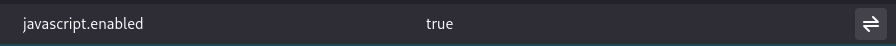<br>
</center><br>
Done<br>

Finally we can open the page, as we already noticed page has no more .php extension<br>
<center>
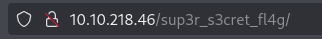<br>
 
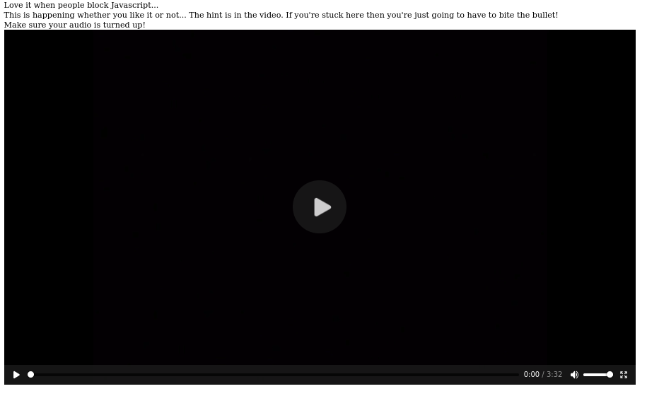
<center><br>


YOU HAVE TO WATCH THE VIDEO :))) it will give you the hint for future steps:<br>


We can notice weird burp sound from the guy in the video which says go to the BURPSUITE)), and also noticed some reddirect moves when we opened our .php file lets check it with BURPSUITE:<br>
<center>
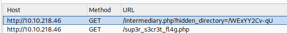<br>
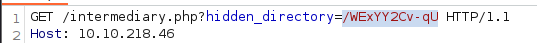<br>
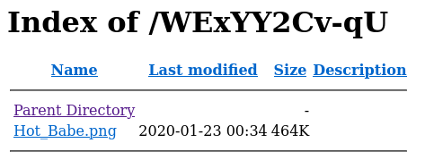
</center><br>


<h2><span style="color:red"><strong>2. ☠️ Exploitation Part</strong></span></h2><br>


We found one picture where says Hot_babe xD<br> 
lets get that image and dig further:<br>
<center>
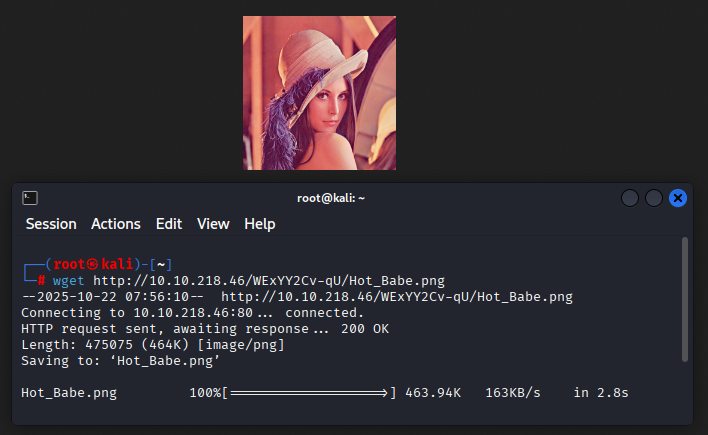
</center><br>


With the comand ```bash binwalk -e Hot_babe.png ``` we can extract some info :<br>
<center>
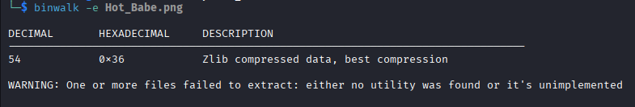<br>
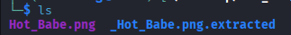<br>
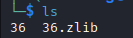<br>
</center><br>


With command ```bash strings ``` lets get some more info:<br>
<center>
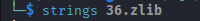
</center><br>

Oh, we got a hint to the next step (we have now a username for FTP and few passes)<br>
<center>
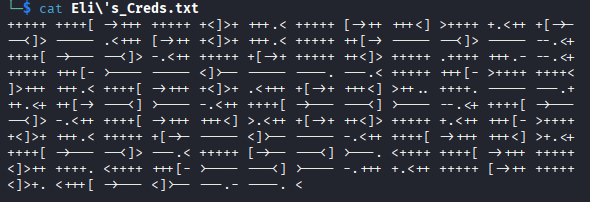
</center><br>

Le'ts use hydra to get a valid password:<br>
<center>
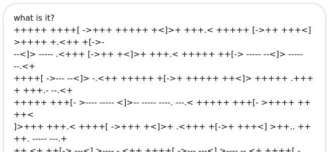
</center><br>


And let's connect to the ftp:<br>
<center>
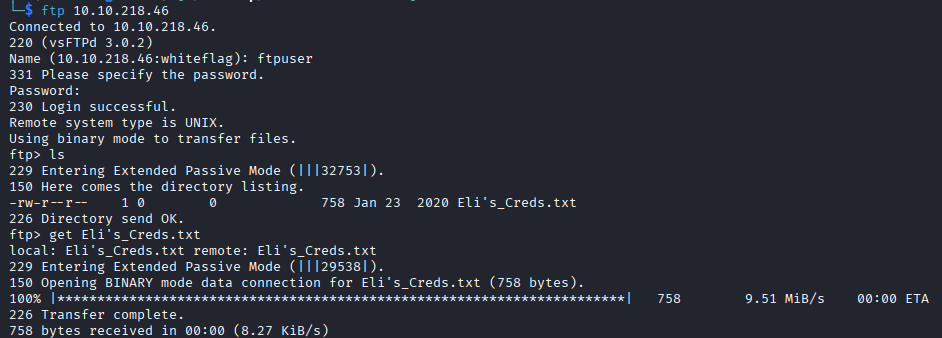 
</center><br>

As we've connected, let's get files from there:<br>
<center>

</center><br>

Creds.txt show us some symbols, simple GPT short message will tell us what are we dealing with:<br>
<center>

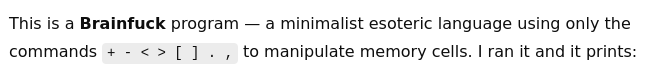
</center><br>

Finding online tool for decode and get our new creds<br>
<center>
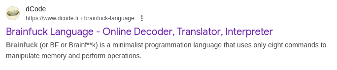
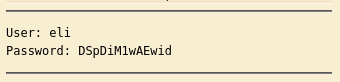
<center>
<br>

Lets ssh to the system:<br>
<center>
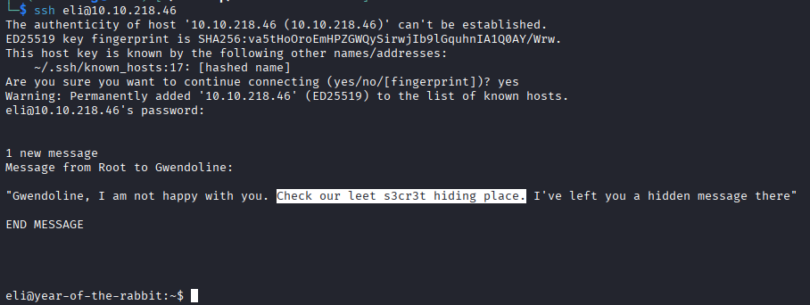
</center><br>
And check the message:<br>
<center>
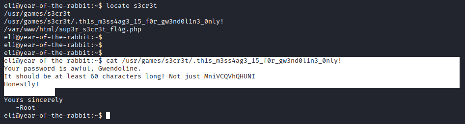
</center><br>

<h2><span style="color:red">3. 🔓 Privilege Escalation Part</span></h2><br>

We found creds of Login as a gwendoline<br> 
<center>
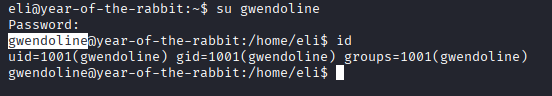
</center><br>

Use ```bash sudo -V``` ```bash sudo -l``` commands to check possibility for privesc:<br>
<center>
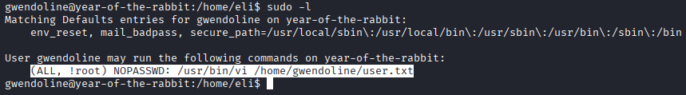<br>
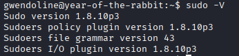
</center><br>
 
Ok, lets dig what technik we can use with that sudo version:<br>
<center>
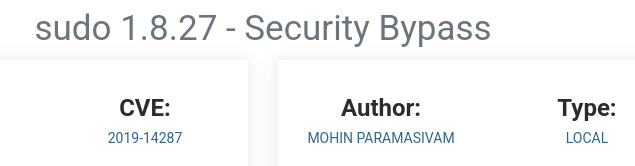
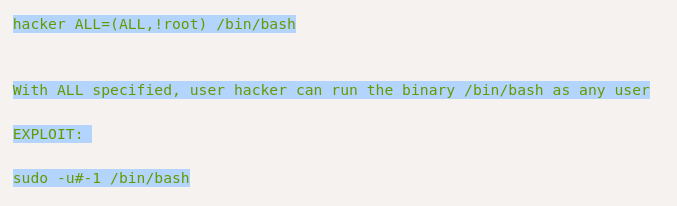
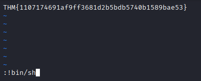
</center><br>
 
<center>
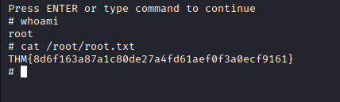
</center><br> 
<center>
We are root!
</center>
